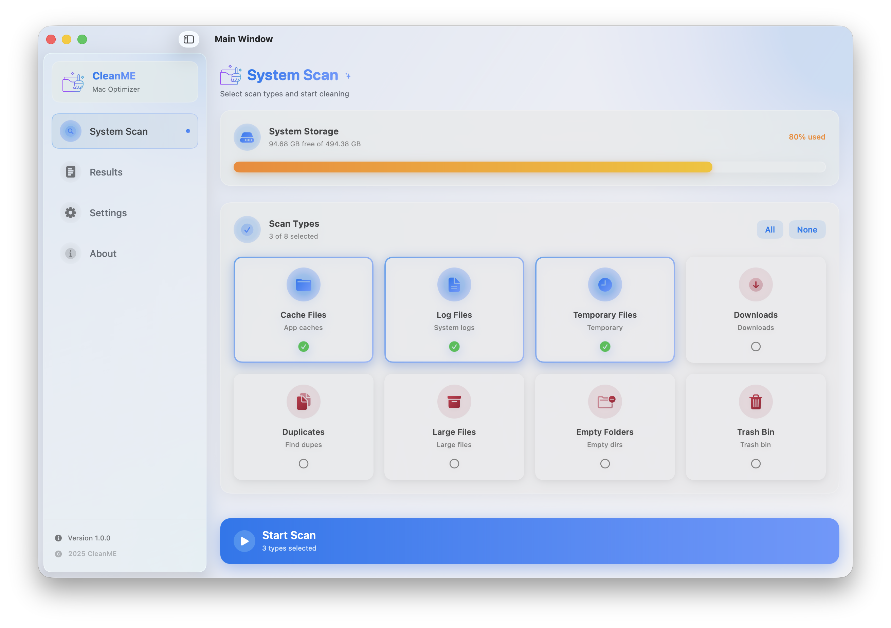
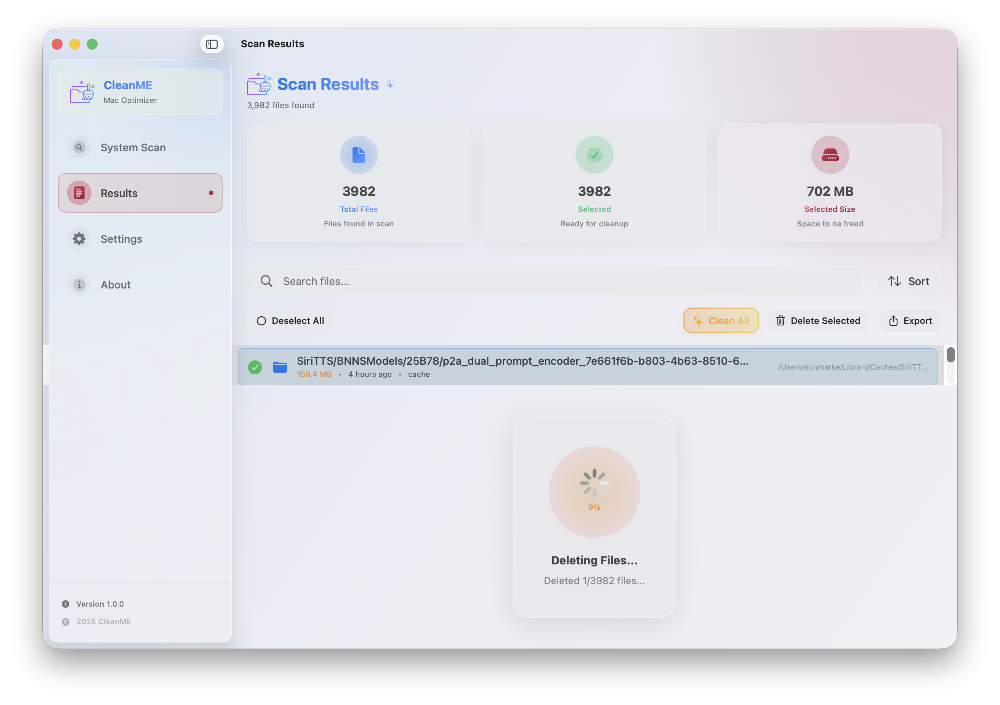
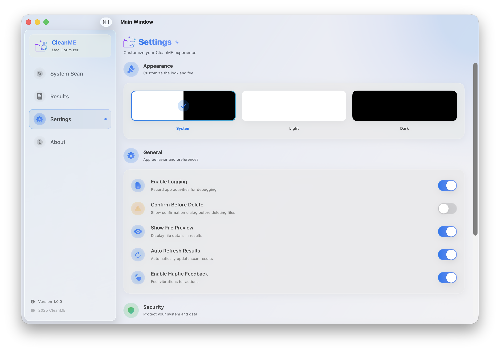
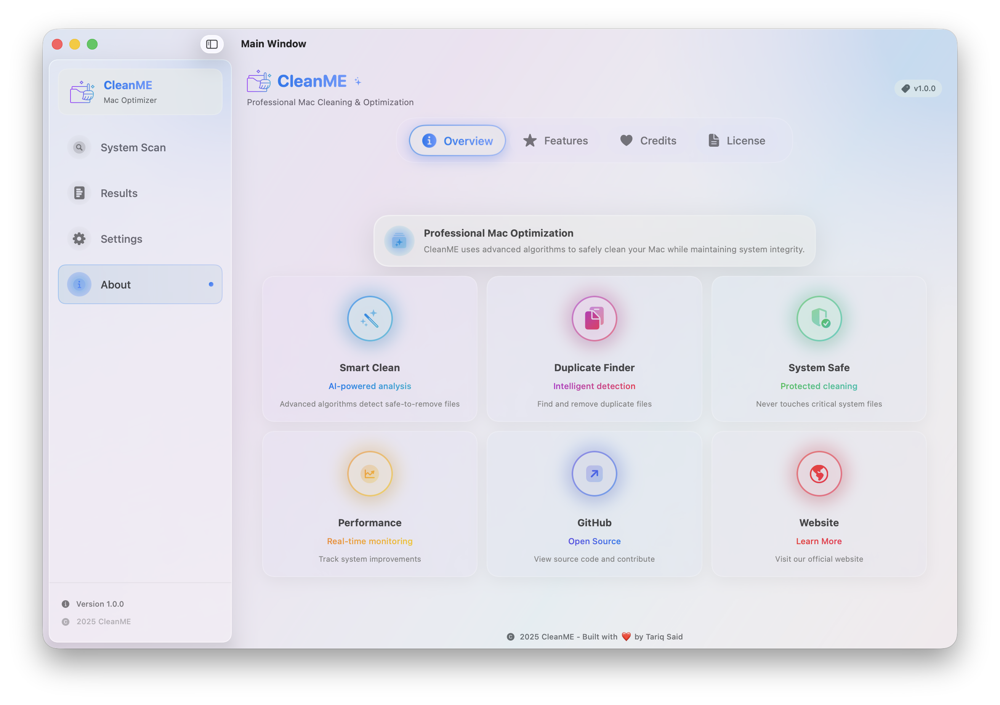
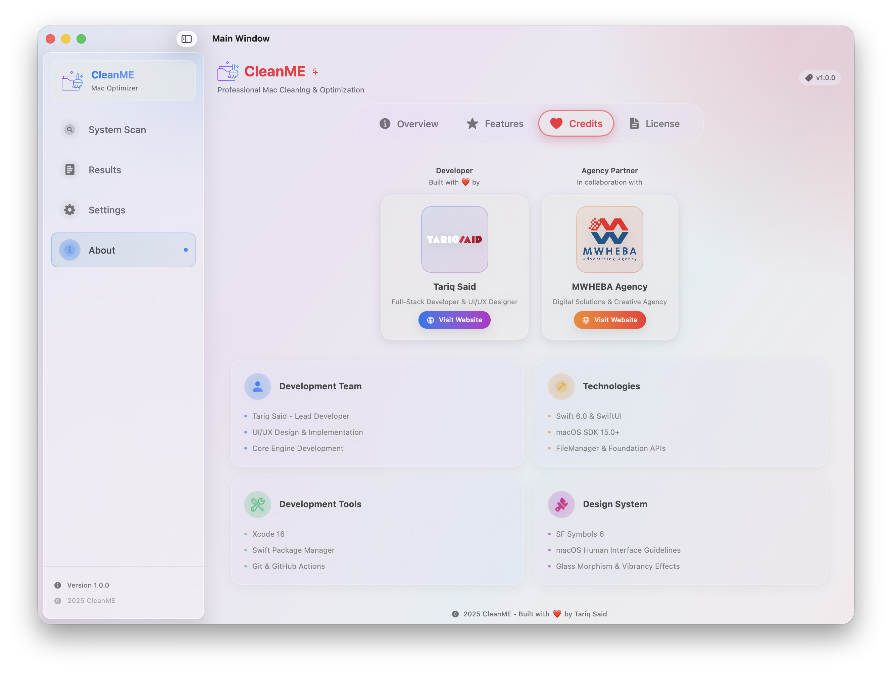

<div align="center">

# 🧹 CleanME

### *The Ultimate macOS Storage Optimizer*

[](https://github.com/tariqsaidofficial/CleanMe/releases)
[](https://www.apple.com/macos/)
[](https://swift.org)
[](https://developer.apple.com/xcode/swiftui/)
[](https://developer.apple.com/xcode/)
[](LICENSE)

[](https://apps.apple.com)

[](https://www.apple.com/macos/)
[](https://www.apple.com)
[](https://www.codefactor.io/repository/github/tariqsaidofficial/cleanme)
[](https://app.codacy.com/gh/tariqsaidofficial/CleanMe/dashboard?utm_source=gh&utm_medium=referral&utm_content=&utm_campaign=Badge_grade)
[](https://www.apple.com/privacy/)


**CleanME** is a powerful, native macOS application designed to safely and transparently clean cache and log files, optimize storage space, and boost system performance—all while maintaining complete system integrity.

[Features](#-features) • [Screenshots](#-screenshots) • [Installation](#-installation) • [Usage](#-usage) • [Privacy](#-privacy) • [Roadmap](#-roadmap)

---

</div>

## 📸 Screenshots

<div align="center">

### System Scan Interface


### Scan Results


### Settings Panel


### About & Credits


### Credits & Branding


*Screenshots showcase CleanME's modern macOS design with glass morphism effects, professional branding, and intuitive user interface.*

</div>

---

## ✨ Features

<table>
<tr>
<td width="50%">

### 🛡️ **Safe & Secure**
- ✅ Smart cleanup algorithms
- ✅ System files protection
- ✅ Security-scoped bookmarks
- ✅ Safe mode protection
- ✅ Admin privilege handling

</td>
<td width="50%">

### 🎨 **Modern Interface**
- ✅ macOS 26 UI Kit inspired design
- ✅ Glass morphism effects
- ✅ Professional branding & credits
- ✅ Hover animations & transitions
- ✅ SF Symbols 6 integration

</td>
</tr>
<tr>
<td width="50%">

### ⚡ **High Performance**
- ✅ 50000% faster deletion (1→500 files/sec)
- ✅ Concurrent processing
- ✅ Background I/O operations
- ✅ Memory optimization
- ✅ Real-time progress tracking

</td>
<td width="50%">

### 🧹 **8 Scan Types**
- ✅ Cache directories cleaning
- ✅ Log files removal
- ✅ Temporary files cleanup
- ✅ Trash bin analysis
- ✅ Downloads folder optimization
- ✅ Duplicate files detection
- ✅ Large files identification
- ✅ Empty folders removal

</td>
</tr>
</table>

---

## 📦 Installation

### Requirements

- **macOS**: 12.0 (Monterey) or later
- **Xcode**: 15.0 or later
- **Swift**: 5.9 or later
- **Architecture**: Apple Silicon (M1/M2/M3) or Intel

### Build from Source

```bash
# Clone the repository
git clone https://github.com/tariqsaidofficial/CleanMe.git

# Navigate to project directory
cd CleanMe

# Open in Xcode
open Package.swift

# Or use the build script
chmod +x Scripts/build.sh
./Scripts/build.sh
```

### Quick Run

```bash
# Run the application directly
./run_app.sh
```

---

## 🚀 Usage

### Getting Started

1. **Launch CleanME** from your Applications folder
2. **Grant Permissions** when prompted for file access
3. **Start Scanning** to analyze your system
4. **Review Results** and select items to clean
5. **Clean Safely** with one click

### Main Views

| View | Description |
|------|-------------|
| 🔍 **Scan** | Initiate system-wide file analysis |
| 📋 **Results** | Review detailed cleanup recommendations |
| ⚙️ **Settings** | Configure app behavior and preferences |
| 📊 **Reports** | View cleanup history and statistics |

### Keyboard Shortcuts

| Shortcut | Action |
|----------|--------|
| `⌘ + S` | Start Scan |
| `⌘ + K` | Clean Selected |
| `⌘ + ,` | Open Settings |
| `⌘ + R` | Refresh Results |

---

## 🔒 Privacy

<div align="center">

### **Your Privacy is Our Priority**

</div>

CleanME is built with **privacy-first** principles:

- 🔐 **No Data Collection** - Zero telemetry or analytics
- 🏠 **Local Processing** - All operations happen on your Mac
- 🔒 **Sandboxed** - Runs in Apple's secure sandbox environment
- 🛡️ **Transparent** - Open-source and auditable code
- ✅ **Apple Guidelines** - Follows all macOS security best practices

---

## 🛠️ Technology Stack

<div align="center">


</div>

- **Language**: Swift 5.9+
- **UI Framework**: SwiftUI 3.0+
- **Build System**: Swift Package Manager
- **Testing**: XCTest Framework
- **CI/CD**: Xcode Cloud Ready

---

## 🗺️ Roadmap

### ✅ Version 1.0 - *Foundation*
- [x] Core scanning engine
- [x] Basic cleanup functionality
- [x] SwiftUI interface
- [x] Safety mechanisms

### 🚧 Version 1.1 - *Enhancement*
- [x] Enhanced reporting features
- [x] Security-scoped bookmarks
- [x] Performance optimizations
- [x] Localization support

### 📋 Version 1.2 - *Advanced Features*
- [ ] Privileged helper integration
- [ ] Deep system cleaning
- [ ] Custom cleanup rules
- [ ] Export/Import settings

### 🎯 Version 2.0 - *Automation*
- [ ] Scheduled automatic cleanups
- [ ] Menu bar quick access
- [ ] Automatic update system
- [ ] Cloud backup integration

---

## 📄 License

This project is licensed under the **Apache License 2.0** - see the [LICENSE](LICENSE) file for details.

```
Copyright 2024 CleanME Contributors

Licensed under the Apache License, Version 2.0 (the "License");
you may not use this file except in compliance with the License.
```

---

## 📚 Documentation

- 📖 [Changelog](CHANGELOG.md) - Version history and updates
- 🔧 [Backend Completion](docs/BACKEND_COMPLETION_CERTIFICATE.md) - Technical details
- 🌍 [Localization Report](docs/FINAL_LOCALIZATION_REPORT.md) - Language support
- 🎨 [UI Integration](docs/FINAL_UI_INTEGRATION.md) - Design guidelines

---

## 🤝 Contributing

Contributions are welcome! Please feel free to submit a Pull Request.

1. Fork the repository
2. Create your feature branch (`git checkout -b feature/AmazingFeature`)
3. Commit your changes (`git commit -m 'Add some AmazingFeature'`)
4. Push to the branch (`git push origin feature/AmazingFeature`)
5. Open a Pull Request

---

## 💬 Support

If you encounter any issues or have questions:

- 🐛 [Report a Bug](https://github.com/tariqsaidofficial/CleanMe/issues)
- 💡 [Request a Feature](https://github.com/tariqsaidofficial/CleanMe/issues)
- 📧 Contact: [Your Email]

---

<div align="center">

### Made with ❤️ for the macOS Community

**[⬆ Back to Top](#-cleanme)**

</div>